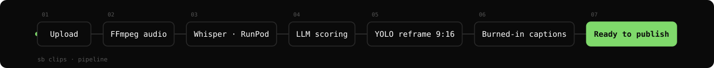

I design and run AI-powered systems for video production and marketing operations at [Grupo SB](https://github.com/seubone), in Natal, Brazil.

I build with AI coding agents every day. What I own is the part they don't:
the problem, the architecture, the constraints, production operations, and measuring whether the AI output is actually good.

### What I'm building

#### 🎬 SB Clips
*Internal platform, private* · [**read the case study →**](https://github.com/kleniobraz/sb-clips-case-study)

Turns long podcasts into ready-to-publish vertical clips and full YouTube episodes.

`Python` `Flask` `Next.js` `n8n` `RunPod serverless GPU` `Claude API` `YOLO` `FFmpeg` `S3` `nginx` `pytest`
Includes evaluation scripts for reframing quality and caption review.

#### 🗂️ MKT Hub
*Internal platform, private, team project*

Operations platform for the Grupo SB marketing team: tasks, delivery checklists, an AI reviewer for creative deliverables, and a REST API.

`TypeScript` `Next.js` `Drizzle` `Postgres` `Zod` `Docker` `GitHub Actions CI`

#### 🔊 Auto SFX Panel
*Public* · [**repo →**](https://github.com/kleniobraz/autosfxklenio)

Premiere Pro panel that places sound effects on timeline cuts automatically.

### How I work

**Spec first, then agents.** Every system has a written contract (state machine, cost rules, what must never happen) that the agents follow.
**I operate what I ship.** Branches, pull requests and CI on the way in; VPS, deploys, incidents and fixes after.

### Currently learning

AI evaluation · Python fundamentals · software architecture · paid traffic analytics

  
  

